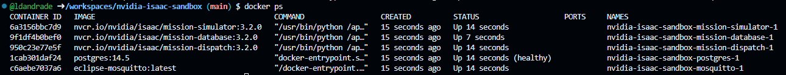
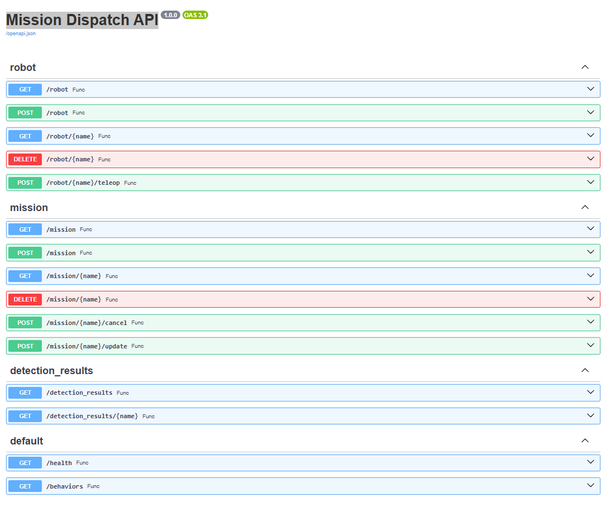

# Nvidia Isaac Mission Dispatch Sandbox/Development Environment

## Table of Contents

- [Getting started](#getting-started)
    - [Codespace](#codespace)
    - [Create a robot](#create-a-robot)
    - [Create a mission](#create-a-mission)
    - [Simulate a mission](#simulate-a-mission)
- [References](#references)
    - [Webinars](#webinars)
    - [Repositories](#repositories)
    - [Nvidia NGC Catalog Containers](#nvidia-ngc-catalog-containers)

## Getting started

### Codespace

To get started with Nvidia Isaac Mission Dispatch sandbox, run the following command to pull and run the Nvidia Isaac containers from NGC:

```bash
docker-compose up -d
```
Once the containers start, you can check their status by running:

```bash
docker ps
```
If everything is fine, you should be able to see 5 containers running as listed in the table below:

| Container ID | Image                                             | Command                     | Status             | Name                                     |
|--------------|---------------------------------------------------|-----------------------------|--------------------|------------------------------------------|
| 7c5e067ace97 | nvcr.io/nvidia/isaac/mission-database:3.2.0       | /usr/bin/python /app/...    | Up About a minute  | nvidia-isaac-sandbox-mission-database-1  |
| 41299dbe8bfa | nvcr.io/nvidia/isaac/mission-simulator:3.2.0      | /usr/bin/python /app/...    | Up About a minute  | nvidia-isaac-sandbox-mission-simulator-1 |
| a8743c1a7f69 | postgres:14.5                                     | docker-entrypoint.sh        | Up (healthy)       | nvidia-isaac-sandbox-postgres-1          |
| b35bd3169cbb | nvcr.io/nvidia/isaac/mission-dispatch:3.2.0       | /usr/bin/python /app/...    | Up About a minute  | nvidia-isaac-sandbox-mission-dispatch-1  |

You can access the Mission Dispatch OpenAPI UI by checking the forwarded address on port 5000 through VS Code Ports tab when connected to Codespaces as shown in the picture below:



> **Note:** Add the suffix /docs to the forwarded address to access the OpenAPI UI:



### Create a Robot

Use the POST /robot API to create a robot in the Isaac Mission Database:

```json
{
  "labels": [],
  "battery": {
    "critical_level": 10
  },
  "heartbeat_timeout": 30,
  "switch_teleop": false,
  "name": "R2D2"
}
```

You can either use the OpenAPI UI or a CLI tool such as curl:

```bash
curl -X 'POST' \
  '<https://<uri_prefix>/robot>' \
  -H 'accept: application/json' \
  -H 'Content-Type: application/json' \
  -d '{
  "labels": [],
  "battery": {
    "critical_level": 10
  },
  "heartbeat_timeout": 30,
  "switch_teleop": false,
  "name": "R2D2"
}'
```

### Create a Mission

Use the POST /mission API to create a mission in the Isaac Mission Database:

```json
{
  "robot": "R2D2",
  "mission_tree": [
    {
      "name": "string",
      "parent": "root",
      "route": {
        "waypoints": [
          {
            "x": 0,
            "y": 0,
            "theta": 0,
            "map_id": "",
            "allowedDeviationXY": 0.1,
            "allowedDeviationTheta": 0
          }
        ]
      },
      "move": {
        "distance": 0,
        "rotation": 0
      },
      "action": {
        "action_type": "string",
        "action_parameters": {}
      },
      "notify": {
        "url": "string",
        "json_data": {},
        "timeout": 30
      },
      "selector": {},
      "sequence": {},
      "constant": {
        "success": true
      }
    }
  ],
  "timeout": 300,
  "deadline": "2025-04-11T14:08:27.999Z",
  "needs_canceled": false,
  "update_nodes": {
    "additionalProp1": {
      "waypoints": [
        {
          "x": 0,
          "y": 0,
          "theta": 0,
          "map_id": "",
          "allowedDeviationXY": 0.1,
          "allowedDeviationTheta": 0
        }
      ]
    },
    "additionalProp2": {
      "waypoints": [
        {
          "x": 0,
          "y": 0,
          "theta": 0,
          "map_id": "",
          "allowedDeviationXY": 0.1,
          "allowedDeviationTheta": 0
        }
      ]
    },
    "additionalProp3": {
      "waypoints": [
        {
          "x": 0,
          "y": 0,
          "theta": 0,
          "map_id": "",
          "allowedDeviationXY": 0.1,
          "allowedDeviationTheta": 0
        }
      ]
    }
  },
  "name": "mission_1"
}
```
Similarly you can use the OpenAPI UI or a CLI tool to submit the POST request.

### Simulate a Mission

As both robot and mission are registered in the database, you can run the Mission Simulator with the command --robots indicating the name of the registered robot that will perform the mission.

> **Note:** Each mission is assigned to a specific robot when registered in the mission database.

Below is an example of how to run the mission simulator:

```bash
docker run -it --network host nvcr.io/nvidia/isaac/mission-simulator --robots R2D2,0.0,0.0
```

## References

### Webinars

Learn more about missions by watching the on-demand webinar:

Build Connected Robots with NVIDIA Isaac Dispatch and Client
https://gateway.on24.com/wcc/experience/elitenvidiabrill/1407606/3998202/isaac-ros-webinar-series

### Repositories

https://github.com/NVIDIA-ISAAC/isaac_mission_dispatch

https://github.com/NVIDIA-ISAAC/isaac_mission_dispatch?tab=readme-ov-file#add-robots-with-rest-api

https://github.com/NVIDIA-ISAAC/isaac_mission_dispatch?tab=readme-ov-file#submit-missions-with-rest-api

https://github.com/NVIDIA-ISAAC/isaac_mission_dispatch?tab=readme-ov-file#send-telemetry

### Nvidia NGC Catalog Containers

https://catalog.ngc.nvidia.com/orgs/nvidia/teams/isaac/containers/mission-dispatch

https://catalog.ngc.nvidia.com/orgs/nvidia/teams/isaac/containers/mission-database

https://catalog.ngc.nvidia.com/orgs/nvidia/teams/isaac/containers/mission-simulator