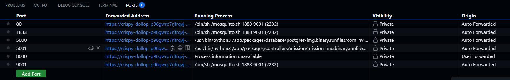
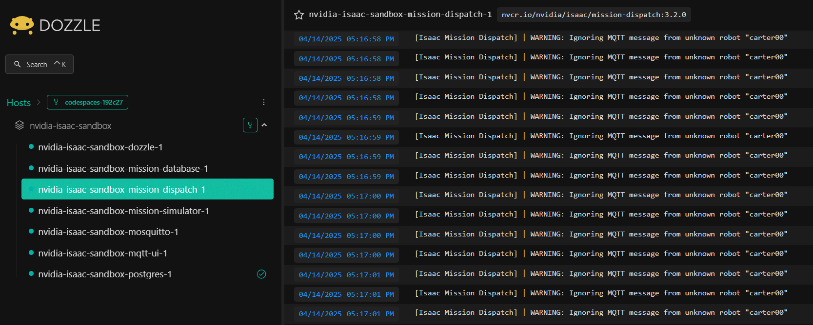
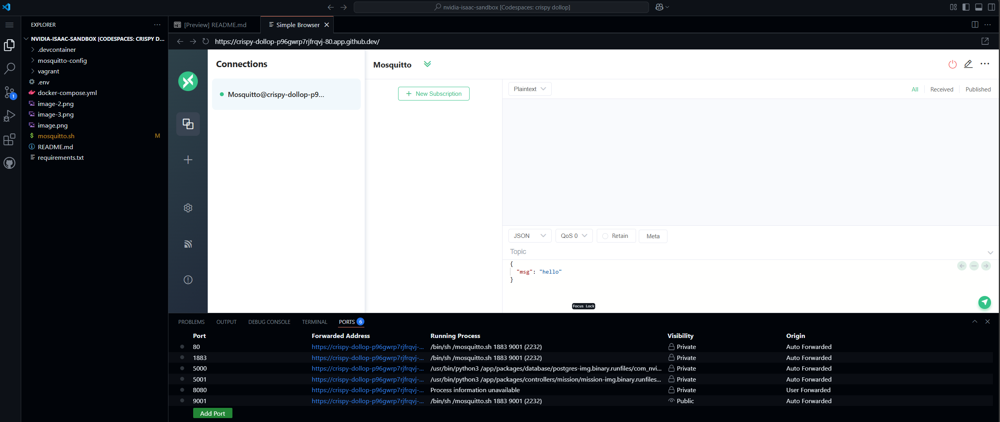

# Nvidia Isaac Mission Dispatch Sandbox/Development Environment

## Table of Contents

- [Getting started](#getting-started)
    - [Codespace](#codespace)
    - [Create a robot](#create-a-robot)
    - [Create a mission](#create-a-mission)
    - [Simulate a mission](#simulate-a-mission)
- [Monitoring](#monitoring)
    - [Dozzle](#dozzle)
    - [EMQx MQTTX Web](#emqx-mqttx-web)
- [References](#references)
    - [Webinars](#webinars)
    - [Repositories](#repositories)
    - [Nvidia NGC Catalog Containers](#nvidia-ngc-catalog-containers)

## Getting started

### Codespace

To get started with Nvidia Isaac Mission Dispatch sandbox, run the following command to pull and run the Nvidia Isaac containers from NGC:

```bash
docker-compose up -d
```
Once the containers start, you can check their status by running:

```bash
docker ps
```
If everything is fine, you should be able to see 5 containers running as listed in the table below:

| Container ID | Image                                             | Command                     | Status             | Name                                     |
|--------------|---------------------------------------------------|-----------------------------|--------------------|------------------------------------------|
| 7c5e067ace97 | nvcr.io/nvidia/isaac/mission-database:3.2.0       | /usr/bin/python /app/...    | Up About a minute  | nvidia-isaac-sandbox-mission-database-1  |
| 41299dbe8bfa | nvcr.io/nvidia/isaac/mission-simulator:3.2.0      | /usr/bin/python /app/...    | Up About a minute  | nvidia-isaac-sandbox-mission-simulator-1 |
| b35bd3169cbb | nvcr.io/nvidia/isaac/mission-dispatch:3.2.0       | /usr/bin/python /app/...    | Up About a minute  | nvidia-isaac-sandbox-mission-dispatch-1  |
| a8743c1a7f69 | postgres:14.5                                     | docker-entrypoint.sh        | Up (healthy)       | nvidia-isaac-sandbox-postgres-1          |
| ff4f878983bf | eclipse-mosquitto:latest                          | docker-entrypoint.sh        | Up About a minute  | nvidia-isaac-sandbox-mosquitto-1         |

> **Note:** The mission simulator container is intended solely for simulating mission steps for a robot. To use it effectively, follow the instructions in the sections below to create a specific robot and assign it a mission, then simulate it using this container. Alternatively, ensure that the default robot (carter00) has already been created and assigned a mission. If no corresponding robot and mission exist, you'll see the following warning in the Mission Dispatch container logs:
[Isaac Mission Dispatch] | WARNING: Ignoring MQTT message from unknown robot "carter00"

You can access the Mission Dispatch OpenAPI UI by checking the forwarded address on port 5000 through VS Code Ports tab when connected to Codespaces as shown in the picture below:


> **Note:** Add the suffix /docs to the forwarded address to access the OpenAPI UI:


### Create a Robot

Use the POST /robot API to create a robot in the Isaac Mission Database:

```json
{
  "labels": [],
  "battery": {
    "critical_level": 10
  },
  "heartbeat_timeout": 30,
  "switch_teleop": false,
  "name": "R2D2"
}
```

You can either use the OpenAPI UI or a CLI tool such as curl:

```bash
curl -X 'POST' \
  '<https://<uri_prefix>/robot>' \
  -H 'accept: application/json' \
  -H 'Content-Type: application/json' \
  -d '{
  "labels": [],
  "battery": {
    "critical_level": 10
  },
  "heartbeat_timeout": 30,
  "switch_teleop": false,
  "name": "R2D2"
}'
```

If you are following the logs from the Mission Dispatch container, you will see the following confirmation as the robot is created:

```bash
[Isaac Mission Dispatch] | INFO: [R2D2] Created robot
[Isaac Mission Dispatch] | INFO: [R2D2] FACTSHEET INFO: Sending factsheetRequest action.
```

### Create a Mission

Use the POST /mission API to create a mission in the Isaac Mission Database:

```json
{
    "robot": "R2D2",
    "mission_tree": [
        {
            "name": "deliver_holo_message",
            "parent": "root",
            "route": {
                "waypoints": [
                    {
                        "x": 1.5,
                        "y": 1.5,
                        "theta": 0,
                        "map_id": "tatooine_base"
                    },
                    {
                        "x": 3.3,
                        "y": 2.1,
                        "theta": 0,
                        "map_id": "tatooine_base"
                    }
                ]
            }
        },
        {
            "name": "exit_route",
            "parent": "root",
            "route": {
                "waypoints": [
                    {
                        "x": 4,
                        "y": 3.2,
                        "theta": 0,
                        "map_id": "tatooine_base"
                    },
                    {
                        "x": 5,
                        "y": 5,
                        "theta": 0,
                        "map_id": "tatooine_base"
                    }
                ]
            }
        }
    ],
    "timeout": 300,
    "deadline": "2023-09-28T04:04:24.013Z",
    "needs_canceled": false,
    "name": "deliver-princess-leia-message"
}
```
Similarly you can use the OpenAPI UI or a CLI tool to submit the POST request.

As soon as you POST the robot's mission, the following confirmation will appear in the Mission Dispatch container logs:

```bash
[Isaac Mission Dispatch] | INFO: [R2D2] Received a new mission [deliver-princess-leia-message]
[Isaac Mission Dispatch] | INFO: [R2D2] [Mission ID - deliver-princess-leia-message] Mission state: PENDING -> RUNNING
[Isaac Mission Dispatch] | INFO: [R2D2] Robot state: RobotStateV1.IDLE -> RobotStateV1.ON_TASK
[Isaac Mission Dispatch] | INFO: [R2D2] [Mission ID - deliver-princess-leia-message] Mission started at 2025-04-14 14:24:12.158025
[Isaac Mission Dispatch] | INFO: [R2D2] [Mission ID - deliver-princess-leia-message] Sending mission route node deliver_holo_message
[Isaac Mission Dispatch] | INFO: [R2D2] [Mission ID - deliver-princess-leia-message] Node deliver_holo_message: PENDING -> RUNNING
```

### Simulate a Mission

As both robot and mission are registered in the database, you can simulate its execution by starting the Mission Simulator with the command --robots indicating the name of the registered robot that will perform the mission.

> **Note:** Each mission is assigned to a specific robot when registered in the mission database.

Below is an example of how to run the mission simulator:

```bash
docker run -it --network host nvcr.io/nvidia/isaac/mission-simulator:3.2.0 --robots R2D2,0.0,0.0
```

Looking through the logs of the Mission Dispatch, you will see the following:

```bash
[Isaac Mission Dispatch] | INFO: [R2D2] Robot Online
[Isaac Mission Dispatch] | INFO: [R2D2] [Mission ID - deliver-princess-leia-message] Resend factsheetRequest instant action.
[Isaac Mission Dispatch] | INFO: [R2D2] [deliver-princess-leia-message] Got message from another mission order: 
[Isaac Mission Dispatch] | INFO: [R2D2] [Mission ID - deliver-princess-leia-message] Sending mission route node deliver_holo_message
[Isaac Mission Dispatch] | INFO: [R2D2] [Mission ID - deliver-princess-leia-message] Resend factsheetRequest instant action.
[Isaac Mission Dispatch] | INFO: [R2D2] [Mission ID - deliver-princess-leia-message] Node deliver_holo_message: RUNNING -> COMPLETED
[Isaac Mission Dispatch] | INFO: [R2D2] update mission node: 1
[Isaac Mission Dispatch] | INFO: [R2D2] [Mission ID - deliver-princess-leia-message] Update node from deliver_holo_message to exit_route
[Isaac Mission Dispatch] | INFO: [R2D2] [Mission ID - deliver-princess-leia-message] Sending mission route node exit_route
[Isaac Mission Dispatch] | INFO: [R2D2] [Mission ID - deliver-princess-leia-message] Node exit_route: PENDING -> RUNNING
[Isaac Mission Dispatch] | INFO: [R2D2] [Mission ID - deliver-princess-leia-message] Resend factsheetRequest instant action.
[Isaac Mission Dispatch] | INFO: [R2D2] [Mission ID - deliver-princess-leia-message] Node exit_route: RUNNING -> COMPLETED
[Isaac Mission Dispatch] | INFO: [R2D2] [Mission ID - deliver-princess-leia-message] Mission state: RUNNING -> COMPLETED
[Isaac Mission Dispatch] | INFO: [R2D2] [Mission ID - deliver-princess-leia-message] Mission completed at 2025-04-14 14:26:47.722503
[Isaac Mission Dispatch] | INFO: [R2D2] [Mission ID - deliver-princess-leia-message] Mission duration: 0:02:35.564478
[Isaac Mission Dispatch] | INFO: [R2D2] Robot state: RobotStateV1.ON_TASK -> RobotStateV1.IDLE
```

## Monitoring

### Dozzle

In order to facilitate access to docker logs, troubleshooting and monitoring, Dozzle was included in the Docker compose deployment file. 

> **Note:** You may need to manually expose its port (8080) through VS Code Ports tab.



You can then access Dozzle UI as depicted below:



### EMQx MQTTX Web

You can also leverage EMQx MQTTX Web UI to track MQTT messages passing through Mosquitto.

Because of security limitations, you'd have to access the Web UI from within Codespaces UI as can be seen in the picture below:



The connection configuration for should be filled as following:

- Name: Mosquitto
- Host: ws://crispy-dollop-p96gwrp7jfrqvj-9001.app.github.dev
- Port: 9001
- Client ID: mqttx-codespace-client
- Path: /
- Username: (leave blank)
- Password: (leave blank)
- SSL/TLS: Disabled

> **Note:** If you want to connect to it using a local MQTT Client in your local PC you would need to setup SSL/TLS.

## References

### Documentation

https://mqttx.app/
https://dozzle.dev/guide/what-is-dozzle

### Webinars

Learn more about missions by watching the on-demand webinar:

Build Connected Robots with NVIDIA Isaac Dispatch and Client
https://gateway.on24.com/wcc/experience/elitenvidiabrill/1407606/3998202/isaac-ros-webinar-series

### Repositories

https://github.com/NVIDIA-ISAAC/isaac_mission_dispatch

https://github.com/NVIDIA-ISAAC/isaac_mission_dispatch?tab=readme-ov-file#add-robots-with-rest-api

https://github.com/NVIDIA-ISAAC/isaac_mission_dispatch?tab=readme-ov-file#submit-missions-with-rest-api

https://github.com/NVIDIA-ISAAC/isaac_mission_dispatch?tab=readme-ov-file#send-telemetry

### Nvidia NGC Catalog Containers

https://catalog.ngc.nvidia.com/orgs/nvidia/teams/isaac/containers/mission-dispatch

https://catalog.ngc.nvidia.com/orgs/nvidia/teams/isaac/containers/mission-database

https://catalog.ngc.nvidia.com/orgs/nvidia/teams/isaac/containers/mission-simulator